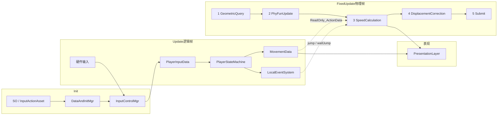

# New2DObject — 2D 运动学物理框架

基于 Unity 的自制 2D **运动学（Kinematics）** 框架：逻辑与 Mono 调度解耦，输入经状态机过滤后再进入物理执行层。适合平台跳跃、环境力场、可扩展角色/NPC 组装。

> 结构示意（三页：概述流程 / 结构 / 数据流）：[`Docs/物理框架结构图.drawio`](Docs/物理框架结构图.drawio)  
> 可用 [diagrams.net](https://app.diagrams.net/) 或 VS Code Draw.io 插件打开。  
> **开发设计文档索引：** [`Docs/README.md`](Docs/README.md)  
> **漏洞与功能安排：** [`Docs/漏洞与功能安排.md`](Docs/漏洞与功能安排.md)  
> **事务具体安排与评估：** [`Docs/事务具体安排与评估/README.md`](Docs/事务具体安排与评估/README.md)  
> 接触速度算法（历史回顾）见 [`04-实体接触速度算法.md`](Docs/事务具体安排与评估/04-实体接触速度算法.md)

---

## 设计原则

| # | 原则 | 落地方式 |
|---|------|----------|
| 1 | **逻辑脱离 Mono** | `PlayerStateMachine` 等为纯 C#；`MonoBehaviour` 只做容器、调度与生命周期 |
| 2 | **单向数据管线** | 外来输入 → 实际类别调度 → 行为策略 → 执行 → 表现；下层只读快照，禁止回写 |
| 3 | **行为 vs 执行** | 行为策略只决定「能否做 / 做什么」；执行层只算速度、位移或其它效果 |
| 4 | **几何 vs 实体职能** | `GeometryPhysicsData` 只描述碰撞感知；环境逻辑走接口（`IForceAction` 等） |
| 5 | **环境力 Enter/Exit** | 平台/冰面/力场统一注册粘滞力、状态速度、动态力，避免每帧硬编码 |
| 6 | **接口扩展** | 新增环境类型优先实现接口，少改底层几何查询 |
| 7 | **角色对象四层组装** | 一层一个挂载脚本：实际类别 / 行为策略 / 执行 / 表现；输入绑定不是角色层 |
| 8 | **配置外置** | 检测层、盒尺寸等走 `SO_CPhysics` / ScriptableObject |

---

## 层级架构

公共调度不算角色层。一个实际角色（玩家或怪物）由四层组成：实际类别、行为策略、执行、表现。一层对应一个挂载的自定义脚本，该脚本管理同层级其它脚本。上层只写意图，下层只读快照；上一层不宜知晓下一层内部有什么。

```text
┌─────────────────────────────────────────────────────────────┐
│  公共调度                                                     │
│  Main → DataConfigurationMgr / DataAndInitMgr /             │
│         MonoPublicMgr / InputControlMgr / UIMgr …           │
└────────────────────────────┬────────────────────────────────┘
                             │ 注入 InputActionAsset、SO、时序槽；输入是外来数据
┌────────────────────────────▼────────────────────────────────┐
│  实际类别（Player）                                           │
│  回答此角色是谁 · 找到组件并初始化 · 接入该角色需要的外来输入     │
└──────────┬─────────────────┬─────────────────┬──────────────┘
           │                 │                 │
┌──────────▼──────┐ ┌────────▼────────┐ ┌──────▼──────────────┐
│ 行为策略         │ │ 执行             │ │ 表现                │
│ PlayerStateMachine│ │ BasicEntity →   │ │ PresentationLayer   │
│ IsOnGround/Air/  │ │ BasePhysicsEntity│ │ Animator / Flip     │
│ WallSliding      │ │ CharacterPhysics │ │ 只读速度/动作        │
│ LocalEventSystem │ │ + 环境施力体     │ │                     │
└────────┬─────────┘ └────────┬────────┘ └─────────────────────┘
         │ ActionData / Event  │ Geometry + Velocity
         └──────────►──────────┘
```

输入绑定由 `InputControlMgr` 处理，不是角色上单独一层。一层内多种效果在该层做数据组织，不把编排脚本或表现脚本膨胀成全能类。其它角色声明专属「实际类别」脚本，按需关联 AI 等。

### 公共调度

- **`Main`**：DontDestroyOnLoad 入口，按序 `Init` 各管理器。
- **`MonoPublicMgr`**：在 `FixedUpdate` 中按 **时序槽 0→5** 驱动全部物理回调（见下文「物理帧管线」）。
- **`InputControlMgr`**：持有唯一 `PlayerInputData`，由玩家 `BindPlayer` 拉取，保证控制权唯一。
- **`DataAndInitMgr` / `DataConfigurationMgr`**：按键资源、开场 SO（如角色模型名）等。

### 实际类别（`Player`）

`Player` 回答此角色是谁，不写具体物理公式，只负责：

1. `InputControlMgr.BindPlayer(this)` → 注入 `PlayerInputData`
2. 构造 `PlayerStateMachine`、拿到 `CharacterPhysics` / `PresentationLayer`
3. `Start` 时单向注入只读包装：几何、速度、动作数据
4. 每帧 `Update`：仅调用 `fsm.Update(inputData)`

### 行为策略（FSM）

| 类型 | 职责 |
|------|------|
| `PlayerStateMachine` | 状态切换、土狼时间 / 跳跃缓冲 / 空中跳次数 |
| `IsOnGround` / `IsInAir` / `OnWallSliding` | 读输入 + 几何快照 → 写 `MovementData`；瞬时动作走 `LocalEventSystem` |
| `MovementData` / `ReadOnly_ActionData` | 持续意图：`onMove`、`nowState` |
| `E_playEvent` | `jump` / `jumpRelease` / `wallJump`（物理侧订阅后消费） |

**关键边界**：行为策略 **不写** `Rigidbody2D`、不算重力；只产出「可执行动作」与事件。输入数据由本层处理，输入管理器本身不属于本层。

### 执行（运动学）

继承链：

```text
BasicEntity                 实体运动学核心（受力容器 + 五段物理时序）
  └─ BasePhysicsEntity      角色几何查询 / 墙职能解析 / 主动速度钩子
       └─ CharacterPhysics  玩家：读 ActionData、响应跳跃事件、贴墙下滑限速
BasicPhysicalObject         环境施力体基类（Enter/Exit 注册/注销）
  └─ BaseGround             地面：粘滞、跳高修正、平台 Delta
       ├─ Wall / IceGround / Taijie …
ForceField                  力场：动态力 + 粘滞 + 状态速度
PhysicalBox                 可移动箱体：复用 BasicEntity 几何查询
```

受力相关接口（`IPhysicalconstraint.cs`）：

- **`IForceAction`**：受力体（实体）——粘滞力、状态速度、限时速度、动态力
- **`IApplyingForceAction`**：施力体 Enter/Exit
- **`IDynamicAddForce`**：每物理帧可改力类型/大小（如冰面滑行）
- **`ICanMove`**：暴露 `MovingDirection` / `Mobility` 给环境（冰面用移动意图算加速方向）

### 表现

`PresentationLayer` 只读：

- `ReadOnly_ActionData`（朝向、状态）
- `ReadOnly_PlayerPhysicsData` / `ReadOnly_GeometryPhysicsData`

当前实现：按只读快照选择待机、地面移动、起跳、上升、下落、落地与贴墙，并做左右翻转。**不回写**逻辑或物理。局部说明见 [`Assets/Script/Framworker/Function/Performance/README.md`](Assets/Script/Framworker/Function/Performance/README.md)。

---

## 核心数据流（现状）



### 一帧内的分工

| 阶段 | 谁写 | 谁读 | 产物 |
|------|------|------|------|
| 输入 | `InputControlMgr` | — | `moveInput` / `jumpPressed` / `jumpRelease` |
| FSM | 各 `BasePlayerState` | 输入 + 几何只读 | `onMove`、`nowState`、触发事件 |
| 几何查询 | `BasePhysicsEntity` | Collider / Layer | `isGrounded`、墙、法线 |
| 职能更新 | `BasicEntity` | 几何结果 | 进出地面、`nowGround` / 墙引用 |
| 速度 | `CharacterPhysics` + 环境力 | ActionData / 事件 | `horizontalSpeed` + `phyHSpeed` 等 |
| 运动快照 | `BasicEntity` | 速度 + 地面规则 + 平台 Delta | `EntityMotionFrame.plannedWorldDelta` |
| 位移 | `BasicEntity` | 快照基础位移 + 接触偏置 | `rb.MovePosition` |

瞬时按键由 FSM 消费后清零（`jumpPressed = false`），避免 FixedUpdate 丢帧或多吃。

---

## 物理帧管线（`MonoPublicMgr.actionsLen`）

| 槽位 | 回调 | 含义 |
|------|------|------|
| 0 | 如 `Taijie.FixFun` | 平台自位移，先算 `Delta` |
| 1 | `GeometricQuery` | BoxCast 地面/墙，写几何快照 |
| 2 | `PhyFunUpdate` | 地面 Enter/Exit、墙职能解析 |
| 3 | `SpeedCalculation` | 粘滞 → 被动力 → 主动速度 → 重力/跳跃；构建 `EntityMotionFrame`，预测与提交共用 `plannedWorldDelta`（见 `08`） |
| 4 | `DisplacementCorrection` | 实体接触等位置偏置 |
| 5 | 提交 | 基础位移 + 偏置 → 静墙裁剪 → `MovePosition` |

水平速度公式（概念上）：

```text
finalH = horizontalSpeed(主动, ActionData × Mobility × 粘滞倍率)
       + phyHSpeed(限时速度 + 动态力 + 状态速度如传送带)
finalV = verticalSpeed(重力 / 跳跃 / 贴墙限速) + phyVSpeed
```

---

## 可接入的数据流扩展点

管线已预留「过滤 → 调制 → 执行」插槽；下列为推荐接入方式（部分已实现，部分为扩展位）。

### 1. 输入 → FSM 过滤 → 物理（已实现）

```text
PlayerInputData.moveInput
    → IsOnGround / IsInAir 写入 MovementData.onMove
    → CharacterPhysics.HorizontalSpeedCalculation()
         = onMove * speed * (1 + nowPhyNum)
```

贴墙时 FSM 切到 `onWallSliding`，物理侧用 `NowState` 做下滑限速，而不是输入直接改竖直速度。

### 2. FSM 事件 → 物理消费（已实现）

```text
jump / jumpRelease / wallJump
    → LocalEventSystem
    → CharacterPhysics 置位 jump/wallJump 标志
    → PhyEventUpdate 在「主动速度赋值之后」统一消费
```

保证时序：几何与职能先就绪，再改竖直速度，避免空中误跳。

### 3. 动作意图 × 动画曲线 → 合理速度（推荐扩展）

当前 `PresentationLayer` 只消费动作/速度；若要做「起步缓加速 / 刹车曲线 / 动画驱动移动」，建议在 **FSM 与物理之间** 加一层调制，而不是在 Animator 里直接改 `Rigidbody`：

```text
MovementData.onMove          （FSM 过滤后的意图，-1~1）
    × AnimationCurve.eval(t) （加速/减速/转向权重）
    × 地面摩擦 / 空中控制系数
    → EffectiveMove
    → CharacterPhysics.HorizontalSpeedCalculation 使用 EffectiveMove
```

接入建议：

- 在 `MovementData` 增加 `moveWeight` 或独立 `LocomotionFilter`
- 由表现层或独立 `LocomotionCurveDriver` **只写权重**，物理仍只读 `ReadOnly_ActionData`
- 跳跃高度也可曲线化：`upSpeed * jumpCurve.Evaluate(holdTime)`，与现有 `jumpRelease` 斩断并存

### 4. 几何快照 → FSM / AI（已实现只读反馈）

```text
GeometryPhysicsData
    → ReadOnly_GeometryPhysicsData
    → FSM（落地/贴墙切换）
    → 未来 AI Perception（同结构复用，不绑 Player）
```

### 5. 环境力 → 被动速度通道（已实现）

| 类型 | 容器 | 示例 |
|------|------|------|
| 粘滞倍率 | `phyStateDic` → `nowPhyNum` | 水塘减速 |
| 状态速度 | `startSpeedDic` | 传送带 |
| 限时冲量 | `UnderForceList` | 墙跳水平冲量 |
| 动态力 | `dynamicForceDic` + `ForceData` | 冰面加速/松手复原、力场 |

冰面典型流：

```text
玩家 onMove ≠ 0 → IceGround.ForceCalculation → apply（沿意图加速）
玩家 onMove = 0 → controlRecovery（受控减速）
离开 → fadeAway（按自身阻力消退）
```

### 6. 表现 ← 物理（只读，已实现）

```text
PlayerPhysicsData / Geometry / ActionData
    → PresentationLayer（朝向、动画参数）
```

避免 Animator 反向驱动位移，防止 FixedUpdate/Update 打架。

### 7. 未来：Constraint / Solver（设计方向）

将 `CharacterPhysics` 中的硬编码响应逐步收束为：

- **Constraint**：贴墙禁止穿透、斜坡切向等
- **Force**：重力、力场、冲量
- **Solver**：在位移前统一解算

与现有五段时序兼容：Solver 可落在槽位 3~4 之间。

---

## 目录结构（脚本）

```text
Assets/Script/
├── Framworker/
│   ├── Main.cs                      # 入口
│   ├── AOTSystem/                   # 基类、公共 Mgr、事件、对象池
│   ├── Function/
│   │   ├── Physics/                 # Base / Component / Data / Interface / Mgr
│   │   ├── Player/                  # Player、FSM、输入
│   │   └── Performance/             # PresentationLayer
│   ├── UISystem/
│   ├── MusicSystem/
│   └── Editor/Tool/                 # Excel、调试窗
├── Data/                            # SO、表数据
└── Task/                            # 场景流程、相机等，不是物理框架主干
Docs/
├── README.md                        # 文档索引
├── 漏洞与功能安排.md                 # V_/F_ 执行入口
├── 事务具体安排与评估/               # 历史回顾与按问题评估
└── 物理框架结构图.drawio            # 概述 / 继承结构 / 数据流（三页）
```

---

## 快速对照：谁依赖谁

```text
InputControlMgr ──写入──► PlayerInputData     （外来数据，不是角色层）
                              │
                    Player（实际类别：调度 / 初始化）
                              │
              Player.Update ──► FSM ──写入──► MovementData / Events
                              │
              ┌───────────────┼───────────────┐
              ▼               ▼               ▼
     CharacterPhysics   PresentationLayer   （其它角色可接 AI）
              │
         BasicEntity 物理时序
              │
         环境 IApplyingForceAction / IDynamicAddForce
```

只读包装保证：**行为策略与表现不能直接改内部可变字段**，修改必须走 FSM 写口或执行层自身方法。

---

## 运行与依赖提示

- Unity 2D + **新 Input System**（`PlayerInput` + `InputActionAsset`）
- 物理位移使用 `Rigidbody2D.MovePosition`，`gravityScale = 0`（重力自管）
- 检测尺寸 / Layer 配置在 **`SO_CPhysics`**，场景中挂到实体上
- 角色组装：实际类别脚本 + 行为策略 + 执行 + 表现；输入来自管理器，不单独占一层

---

## 相关图例页说明

打开 [`Docs/物理框架结构图.drawio`](Docs/物理框架结构图.drawio)：

1. **第 1 页 — 概述流程**：数据管理器 → 输入管理器 → 逻辑状态机 → 物理组件 → 位移；含 SO 配置与事件瞬时动作。
2. **第 2 页 — 结构**：实体继承树（`BasicEntity` → … → `CharacterPhysics`）、行为策略、`Player` 实际类别、表现层。
3. **第 3 页 — 数据流**：Init / Update / FixedUpdate 三阶段；几何查询 → 职能 → 速度/运动快照 → 位移提交与各 `ReadOnly_*` 快照。

---

## 许可与仓库

仓库：[https://github.com/TaiTanw/New2DObject](https://github.com/TaiTanw/New2DObject)
